# MF0486 | Examen Practico

## Tipo de reconocimiento
1. **En una auditoría se utiliza el servicio de ASN Lookup para identificar los bloques de direcciones IP asignados a la empresa objetivo y luego se consulta Shodan para ver qué servicios están expuestos**
- Pasivo 

  · Es pasivo porque se hace una recopilación de información tramite shodan.io,sin enviar paquetes o hacer escaneos directos a la red o servidores de la empresa objetivo.

2.  **Cuando se una solicitud de consulta DNS Inversa sobre un rango de direcciones IP de la empresa objetivo, con la esperanza de descubrir nombres de dominio internos**
- Activo

  · Es activo porque se interactua directamente con los sistemas para descubrir las vulnerabilidades.

3. **Se analiza las headers response de un host target al visitar la página principal en un navegador, y se toma nota del host y de las tecnologías utilizadas**
- Pasivo 

  · Porque solo accedo a la información que el servidor entrega públicamente al visitar la página web y ademàs no estoy intentando forzar puertos simplemente estoy visitando un navegador.

4. **Se descarga una copia archivada del sitio web de la empresa desde el servicio Wayback Machine para ver qué endpoints y archivos sensibles pudieron haber sido expuestos en el pasado**
- Pasivo

  · No interactúo con los servidores del sitio web de la empresa, toda la información la estoy obteniendo desde un tercero,no dejo huella en los sistemas de la empresa.

5. **Un auditor envía emails falsos con errores tipográficos en los nombres de los destinatarios para identificar qué direcciones de email existen en el servidor de la empresa a partir de las respuestas automáticas**
- Activo 

  · El auditor está enviando mensajes reales al dominio de la empresa, Es una interacción directa con la infraestructura del objetivo.

---- 

## Reconocimiento de dominios 

1. **¿Quién es el registrador?**

  · El registrador es NameCheap, Inc.

2. **¿Cuándo se registró el dominio TryHackMe.com?**

  · 05/11/2025

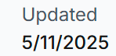

3. **¿Qué empresa utiliza TryHackMe para los servidores?**

  · Cloudflare.com

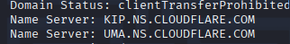

4. **¿Cuál es el ID IANA?**

  · 1068 

5. **¿Cuál es el teléfono del Administrador del dominio?**

  · +354.4212434

· 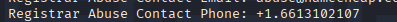

6. **¿De dónde es el prefijo del teléfono?**

  ·  Islandia

7. **En el caso de una incidencia técnica ¿a quién se le debe mandar un mail?**

· `a70a4ff6d25041a48378997194f9e834.protect@withheldforprivacy.com`

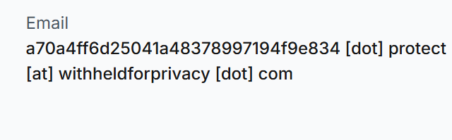

8. **¿Cuál es la dirección completa del Administrador del dominio?**

  · Kalkofnsvegur 2, Reykjavik, Capital Region, 101, IS

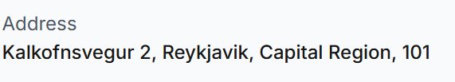

9. **¿Cuál es el ID del dominio de registro de TryHackMe?**

  · 2282723194_DOMAIN_COM-VRSN

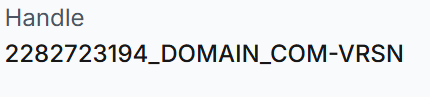

----

# Introducción al análisis de vulnerabilidades - 01

10. **¿Cuál es el primer CVE encontrado de Wordpress?**

  · CVE-2004-1559

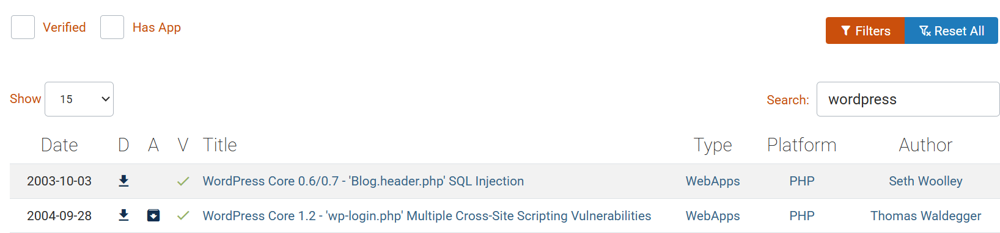

11. **¿Cuánto es su Base Score?**

  · 4.3 Medium

12. **¿A qué configuraciones de software afecta?**

  · cpe:2.3:a:wordpress:wordpress:1.2:*:*:*:*:*:*:*

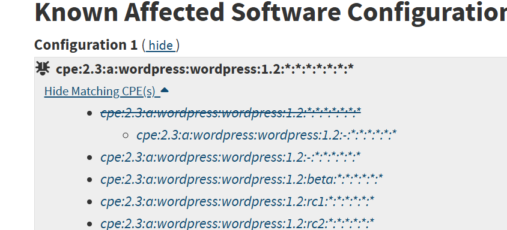

## Introducción al análisis de vulnerabilidades - 02

1. **¿Qué CVE asociado tiene el plugin para Wordpress, Elementor en su versión 2.6.9?**

  · CVE-2024-1234

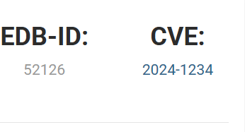

2. **Según Wordfence ¿cúal es su Base Score?**

  · 6.4 MEDIUM

3. **¿Qué es lo que permite realizar al atacante esta vulnerabilidad?**

  · Inject arbitrary web scripts in pages

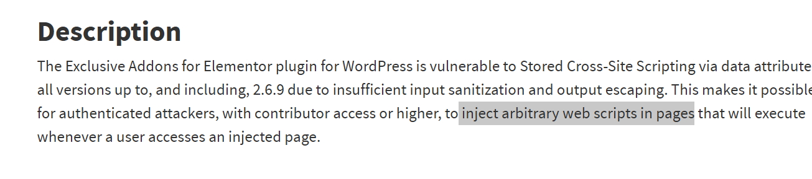

----

## Introducción al análisis de vulnerabilidades - 03

1. **¿Qué problema tuvo Microsoft Excel en 2023?**

  · Microsoft Excel Remote Code Execution Vulnerability

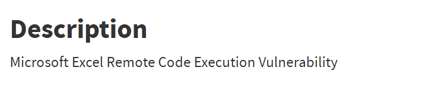

2. **¿Cuál es el CVE asociado a esta vulnerabilidad?**

  · CVE-2023-23399

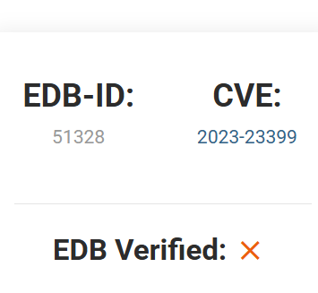

3. **¿Qué Base Score tiene esta vulnerabilidad?**

  · 7.8 high

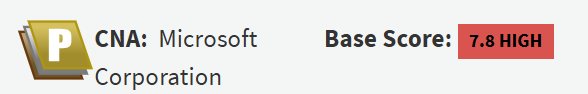

4. **¿Quién es el autor del exploit?**

  · nu11secur1ty

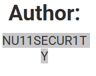

5. **¿Para qué Version y Build está diseñado el exploit?**

  · Version 2302 Build 16.0.16130.20186

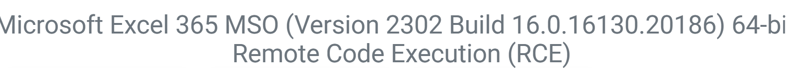

----

# Introducción al análisis de vulnerabilidades - 04

1. **¿Qué CVE se asoció al problema que tuvo Apple con MacOS 10.12 con el Bluetooth?**

  ·  CVE-2016-7617

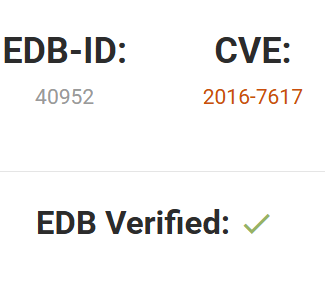

2. **¿Qué Base Score tiene esta vulnerabilidad?**

  · 7.8 HIGH

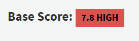

3. **¿Qué configuraciones del sistemas están afectadas por esta vulnerabilidad?**

  · cpe:2.3:o:apple:mac_os_x:*:*:*:*:*:*:*:*

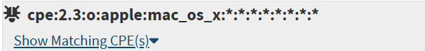

----

## Accediendo al host

1. **¿Cuál es el rango de cada uno de los octetos de una IP?**

  · 0-255

2. **¿Que hace el comando ping -V ?**

  · print version and exit

3. **¿Qué comando utilizarías para hacer ping a la 10.10.67.195 y que después de enviar 6 paquetes corte la comunicación automáticamente?**

  · Ping -c 6 

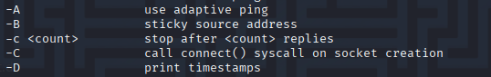

4. **¿Qué protocolo de comunicación utiliza el comando ping ?**

  · ICMP Internet Control Message Protocol

----

## Reconocimeinto del host

1. **¿A través de que puerto se accede al servicio web?**

  · 80

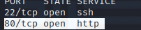

2. **¿A través de que protocolo de comunicación el host muestra la web?**

  · http

3. **¿Qué significa el acrónimo del protocolo?**

  · Protocolo de Transferencia de Hipertexto 

----

##  Reconociento el Web Site 

1. **¿Cúal es el mensaje del la imagen?**

  · You've Been Pwned!

2. **¿Que usuario tiene la imagen en su Desktop?**

  · dnedry

3. **¿Cómo se llama el documento?**

  · pwnedletter.svg

4. **¿Qué version tiene el fichero?**

  · 0.92.5 (2060ec1f9f, 2020-04-08)

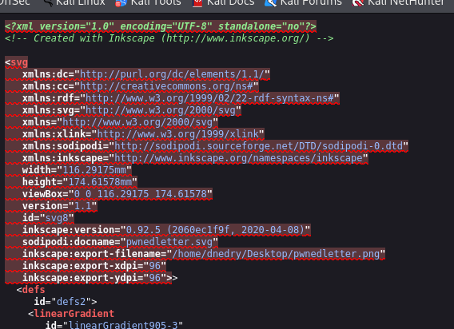

----

## Iniciando el desarrollo

1. **¿Cuál es el acrónimo de Hypertext Preprocessor?**

  · PHP 

2. **¿Qué tipo de licencia tiene lenguaje?**

  · Open source 

3. **¿Cómo se imprimiría Hola Mundo en un HTML con este lenguaje?**

  · `<?php echo "Hola Mundo"; ?>`

4. **¿Este leguaje es de servidor o de cliente?**

  · Servidor 

----

## Accionando keys

1. **¿qué error nos muestra?**

  ·  403 forbidden

2. **¿Cuál es el password del fichero descargado?**

  · 403

3. **¿Cúal es el contendio de la key?**

  · mQENBGfGR1cBCADETBOF2VpERjZcAD7l6Xt/jENbGR/oNHEa9YURsVuDDWNZmjlr uWYoh/tkP9XgciSLlw0fDq9Z9TrrTZ6wLzIwID0+GYYAbKH9xaIbIhReZLyyQYid arI9Q9MXlTfdSE3Ij9nDCjh0jXELCDuzlm5VSmfmLRr2TruavqzBWwnZZizDeo2m 8xdY9iIz7KqTgk5o8iRpsNvwkMQH3UYYrlZ1TTZmQ+sKdW6dIsZNgs6fJOa2mY6A 3VlSKAg28WaFXyQ7mMS9tVo7jZnGip/is3LcPxrkjwIHXaWFvAXLTMUe8Q40Oqis Yva0GqoRQN4woCycHWluEjQUxzy6WQ7YCnPBABEBAAG0GERvZGdzb24gPFBBU1M6 e0RvZGdzb259PokBTgQTAQoAOBYhBNTNkJvqzuOczn7Tx+pIrAmSFXTqBQJnxkdX AhsvBQsJCAcCBhUKCQgLAgQWAgMBAh4BAheAAAoJEOpIrAmSFXTq4SQH/Av1zQkk Sk3nOmQRn5P1K6Sk6SHRKz5HZET4VCCVjjsNkcLGwEX5uQDxBEAbPtW2bvutjBLg Tg6cmCfk6hc9yZ5qFOwFwFVgmCXNKEOzwrijCQqujLvL+ws/DFgQUst/dp+REeTl 6ukg+g1PrqF+CifNXGHNEJPeW1sXgorLJVUzAvPaHwuwwLk2jw9WkkE4RLSjkc11 Ly/CQGYord2Kv8vK/jnnV8b360ImcQPefIqz0Cr/nm07dL0GMCEkiEbHitkgR0Ul tbRqcZ2g/IXcQ8L4gw//+LqinYCLBl4WDvP6kkfFX3Jf5dOw7mtPHrBcA5vRjsGt 7nb/LMzbd2pLS/I= =y/+c

4. **¿Qué comando utilizarías para cambiar la extensión a .asc ?**

  · mv mi_key.php mi_key.asc

5. **¿Cuándo fue creada la key?**

  · 2025-03-04

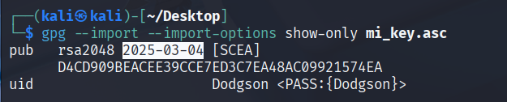

6. **¿Cual es el user id de la key?**

  · PASS:{Dodgson}

7. **¿Cuál es la contraseña?**

  · Dodgson

----

## Accediendo al host

1. **¿Qué aplicación de comunicación utilizarías para conectarte de forma remota a MACHINE_IP ?**

  · SSH

2. **¿Que significa el acrónimo?**

  · Secure shell

3. **¿Cúal es el puerto predeterminado del acceso remoto?**

  ·  22

----

## Reconocimiento interno

1. **¿Ha que directorio se accede por defecto?**

  · /home/dnedry

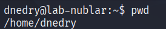

2. **¿Cuántos usuarios tiene el host target?**

  · 25 

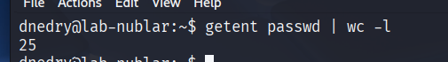

3. **¿Cuál es el nombre completo del usuario?**

  · Dennis Nedry

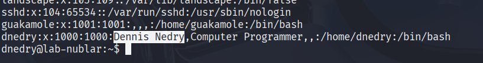

4. **¿Qué idioma tiene el host target?**

  · en_US:en

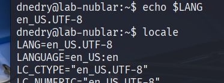

5. **¿Cuál es el hostname?**

  · lab-nublar

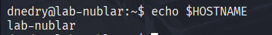

6. **¿Qué Versión del kernel tiene la máquina?**

  · #1337 SMP Wed Mar  3 12:34:56 UTC 1993

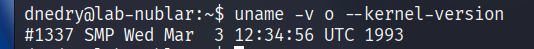

7. **¿Qué comando utilizarías para mostrar el kernel del host target?**

  · uname -s 

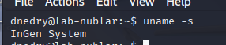

8. **¿Cómo se llama el kernel del host target?**

  · InGen System

9. **¿En que directorio se encuentran los logs?**

  · /var/log/

----
## Ultimate Challenge

1. **¿Qué IP de usuario se descargó el Troyano?**

 · 13.127.130.212

 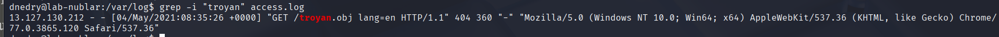

2. **¿A que hora ocurrió el incidente?** 

 · 08:35:26

 

3. **¿Qué usuario provocó el incidente?** 

· www-data

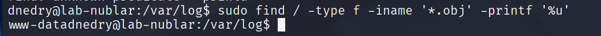

4. **¿Cómo se llama el Troyano?**

· Whte rbt.obj

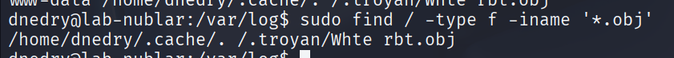

5. **¿Qué permisos tiene el fichero?**

· 001

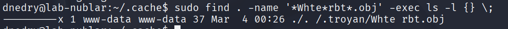

6. **¿Cuál es el contenido del Troyano?**

· YOU DIDN'T SAY THE MAGIC WORD!

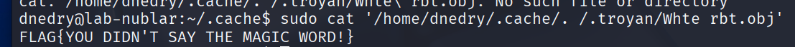

7. **¿Cuál es el contenido de la CFT de root?**

· YOU.C4N.D0.1T

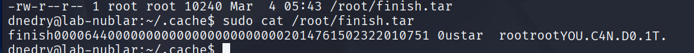

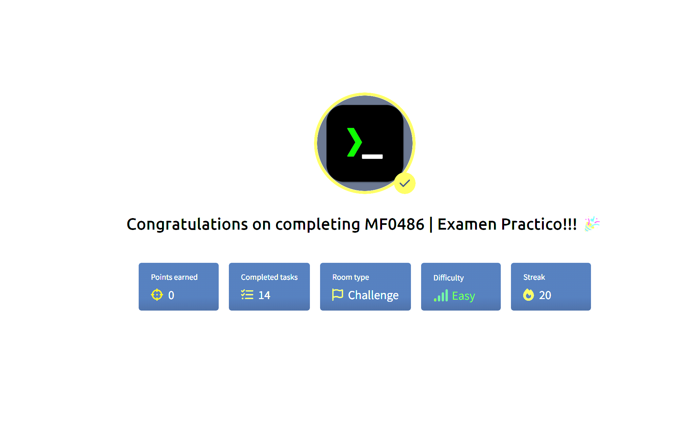